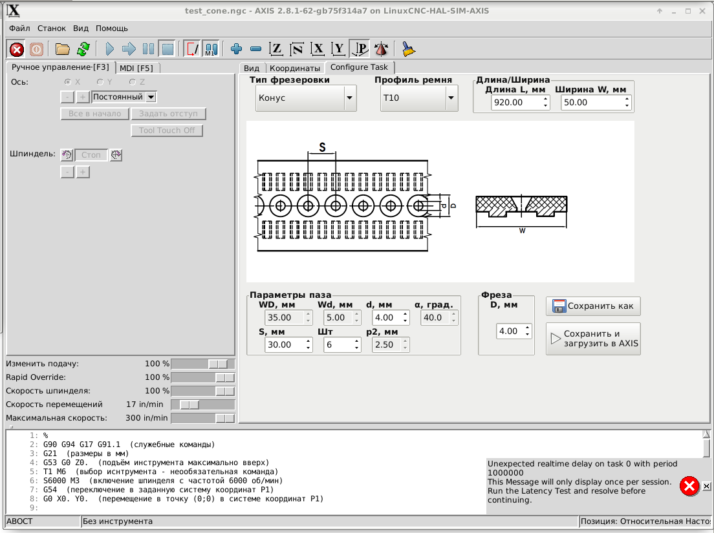

# AXIS_BeltMillPanel

## Инструкция по установке

1.	Убедиться, что машина удовлетворяет требованиями по версии Linux, версии RT-ядра и версии LinuxCNC. Работа панели была успешно протестирована в следующих конфигурациях:
  * LinuxCNC на базе Debian 9 Stretch с патчем PREEMPT-RT (http://www.linuxcnc.org/testing-stretch-rtpreempt/), обновлённая до версии 2.8.
  * LinuxCNC на базе Debian 7 Wheezy (http://www.linuxcnc.org/iso/linuxcnc-2.7.14-wheezy.iso) с патчем RTAI, обновлённая до версии 2.8.1.
Работа в иных сочетаниях Linux, LinuxCNC и ядра возможна, но не тестировалась.
2.	Скопировать файлы репозитория в каталог, где находится исходный ini-файл управляющей программы, в которую необходимо добавить панель.
3.	Добавить в раздел [DISPLAY] ini-файла управляющей программы 2 строки:
```
...
EMBED_TAB_NAME = Configure Task
EMBED_TAB_COMMAND=gladevcp -c gladevcp -x {XID} -u ./ConfigureTaskGlade.py ./ConfigureTaskGlade.ui
...
```
Также в репозитории в качестве примера приводится файл axis_with_panel.ini, запускающий графическую панель AXIS из стандартной комплектации LinuxCNC с добавленной панелью ConfigureTask.

4.	Запустить управляющую программу с помощью команды терминала Linux
```
linuxcnc имя_файла.ini
```
где ```имя_файла.ini``` – ini-файл исходной управляющей программы станка, в которую добавили строки п.3. Убедиться, что в интерфейсе на центральных вкладках появилась панель ConfigureTask (см. рис. ниже).


